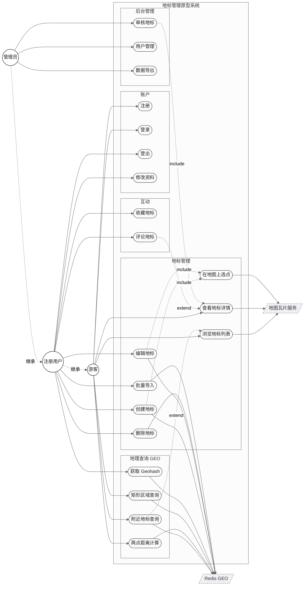

# 用例图

## 一、参与者

| 参与者 | 边界 | 说明 |
|--------|------|------|
| 游客 | 系统外 | 未登录访客，仅可浏览公开内容与基础地理查询 |
| 注册用户 | 系统外 | 登录态用户，可创建与维护自己的地标、参与互动 |
| 管理员 | 系统外 | 拥有审核、用户管理、数据导出权限 |
| Redis GEO | 外部系统 | 承载地标坐标的有序集合与近邻查询能力 |
| 地图瓦片服务 | 外部系统 | 提供底图瓦片（OSM / MapBox / 高德可替换） |

继承：注册用户 → 游客；管理员 → 注册用户。每一层在父级权限基础上叠加自己的能力。

## 二、用例图

下图采用 Mermaid 描述，源文件见 `use-case.mmd`；PlantUML 等价版本见 `use-case.puml`，可上传至 [PlantUML Server](https://www.plantuml.com/plantuml/) 或 VS Code PlantUML 插件渲染。

## 三、用例分组

| 分组 | 用例 | 优先级 |
|------|------|--------|
| 账户 | 注册、登录、登出、修改资料 | P0 / P0 / P0 / P1 |
| 地标管理 | 浏览列表、查看详情、创建、编辑、删除、批量导入、地图选点 | P0 主线，导入为 P1 |
| 地理查询（GEO） | 附近地标、两点距离、区域查询、获取 Geohash | P0 / P0 / P1 / P1 |
| 互动 | 收藏地标、评论地标 | P1 |
| 后台管理 | 审核地标、用户管理、数据导出 | P1 |

## 四、关键用例规约

仅展开核心 P0 用例，其余用例参照同样模板编写。

### UC-C1 附近地标查询

| 字段 | 内容 |
|------|------|
| 主参与者 | 游客 / 注册用户 |
| 范围 | 地标管理原型系统 |
| 触发 | 用户在主页或地图上请求"附近 5 km 地标" |
| 前置条件 | 用户已授予浏览器定位或手动输入坐标 |
| 后置条件 | 系统返回半径内地标列表，按距离升序 |
| 主流程 | 1. 用户提交（lng, lat, radius）；2. 系统校验参数合法（lng∈[-180,180]、lat∈[-85,85]、radius≤50 km）；3. 调用 `GEOSEARCH key FROMLONLAT lng lat BYRADIUS radius km ASC WITHCOORD WITHDIST COUNT 100`；4. 拼装地标元数据并返回 JSON |
| 替代流程 | 2a. 参数非法 → 返回 400；3a. Redis 异常 → 返回 503，记录告警；4a. 命中 0 条 → 返回空数组与提示文案 |
| 涉及外部 | Redis GEO |

### UC-C2 两点距离计算

| 字段 | 内容 |
|------|------|
| 主参与者 | 游客 / 注册用户 |
| 触发 | 用户在详情页选"测距至…" |
| 前置条件 | 两个地标均存在于同一 GEO Key |
| 后置条件 | 返回两地标间直线距离（km，保留 2 位） |
| 主流程 | 1. 用户选择源地标与目标地标；2. 系统调用 `GEODIST key src dst km`；3. 返回结果 |
| 替代流程 | 2a. 任一地标不存在 → 返回 404 |
| 涉及外部 | Redis GEO |

### UC-B1 创建地标

| 字段 | 内容 |
|------|------|
| 主参与者 | 注册用户 |
| 触发 | 用户在"我的地标"页点"新增" |
| 前置条件 | 用户已登录且 Token 有效 |
| 后置条件 | 地标进入待审核状态，Redis 写入坐标 |
| 主流程 | 1. 用户填写名称、类别、描述、图片 URL；2. 通过用例 PICK 在地图上选点取得 (lng, lat)；3. 系统校验字段；4. 写入 MySQL（status=PENDING）并 `GEOADD landmarks:city:{cityId} lng lat memberId`；5. 返回创建成功 |
| 替代流程 | 3a. 校验失败 → 返回 422 与字段级错误；4a. Redis 写入失败 → 回滚 MySQL，返回 500 |
| 涉及外部 | Redis GEO、地图瓦片服务（选点） |

### UC-A1 注册

| 字段 | 内容 |
|------|------|
| 主参与者 | 游客 |
| 触发 | 用户提交注册表单 |
| 前置条件 | 邮箱在系统中未被占用 |
| 后置条件 | 用户记录入库，可立即登录 |
| 主流程 | 1. 用户输入用户名、邮箱、密码；2. 系统校验密码强度（≥ 8 位且含字母+数字）；3. 邮箱去重；4. BCrypt 哈希后入库；5. 返回成功 |
| 替代流程 | 2a. 弱密码 → 422；3a. 邮箱重复 → 409；登录限流被命中 → 429 |
| 涉及外部 | — |

## 五、关系说明

| 类型 | 来源 | 目标 | 含义 |
|------|------|------|------|
| `<<include>>` | 创建地标 | 在地图上选点 | 创建必然嵌入选点动作 |
| `<<include>>` | 编辑地标 | 在地图上选点 | 编辑可重新选点 |
| `<<include>>` | 审核地标 | 查看地标详情 | 管理员审核前必先查看 |
| `<<extend>>` | 附近地标查询 | 浏览地标列表 | 列表浏览的可选扩展：定位排序 |
| `<<extend>>` | 评论地标 | 查看地标详情 | 详情页可选发表评论 |
| `generalization` | 注册用户 → 游客 | — | 注册用户继承游客权限 |
| `generalization` | 管理员 → 注册用户 | — | 管理员叠加审核与管理权 |
