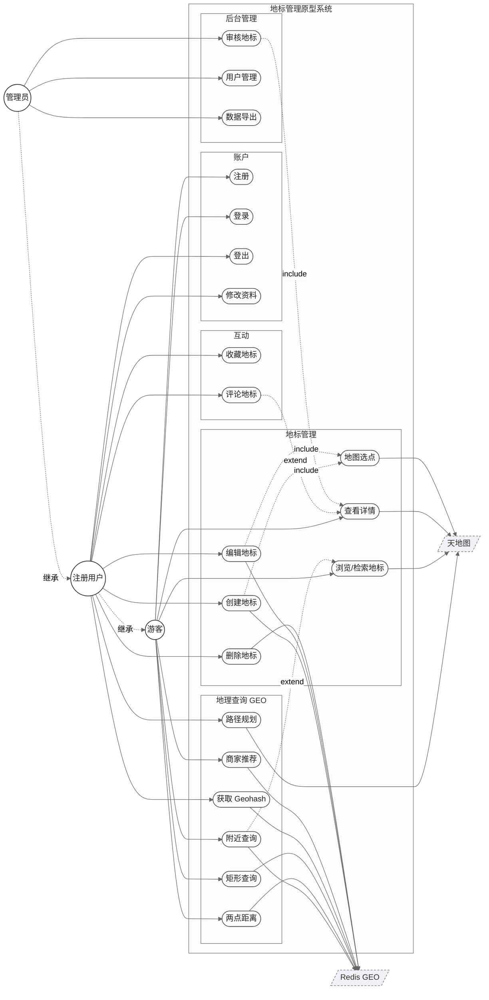
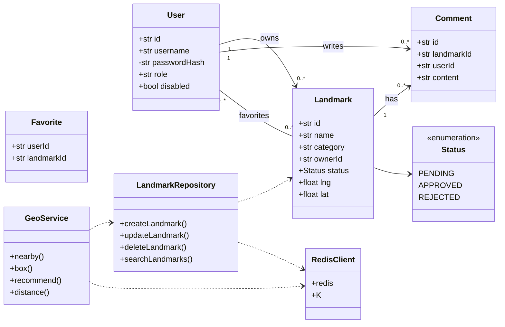

# 地标管理原型系统 · 项目报告

> 软件工程课程设计 · 基于 Redis GEO 的地标录入、检索、推荐与路径规划原型
> 团队:许桐恺(组长)、闫晨曦、肖旭仁、侯躍铖、魏振邦 · 周期:1 周单 Sprint
> 仓库:https://github.com/Kirawii/SE-EXP3

---

## 一、团队组成、分工与工作量

### 1.1 成员与职责

| 编号 | 成员   | Scrum 角色               | 工程职责                                         |
| ---- | ------ | ------------------------ | ------------------------------------------------ |
| 01   | 许桐恺 | Product Owner(组长)    | 需求分析、用例/类图、原型设计、文档汇总、对外协调 |
| 02   | 闫晨曦 | Scrum Master / 后端 Lead | 接口与鉴权设计(JWT/限流)、代码评审、流程协调   |
| 03   | 肖旭仁 | 后端开发(Redis 专项)   | GEO 数据模型、地标 CRUD、推荐算法、社交模块       |
| 04   | 侯躍铖 | 前端开发                 | 全部 Vue 页面、地图集成、路径规划前端            |
| 05   | 魏振邦 | 测试 / DevOps            | pytest 用例、Redis 部署、压测、管理后台联调       |

### 1.2 工作量比例

| 成员   | 主要交付                                           | 工作量 |
| ------ | -------------------------------------------------- | ------ |
| 许桐恺 | 需求规格、用例图、类图、项目报告、原型与验收        | 20 %   |
| 闫晨曦 | 鉴权模块、API 契约、错误体系、代码评审             | 21 %   |
| 肖旭仁 | GEO 索引与查询、地标仓储、推荐打分、收藏/评论后端  | 21 %   |
| 侯躍铖 | 5 类前端页面、Leaflet/天地图集成、测距/路线/推荐 UI | 24 %   |
| 魏振邦 | 端到端测试、Redis 编译部署、CSV 导出、管理后台      | 14 %   |
| 合计   |                                                    | 100 %  |

### 1.3 进度(一周单 Sprint)

| 阶段    | 主线                                   | 交付          |
| ------- | -------------------------------------- | ------------- |
| D1      | 需求评审、技术选型、Redis 部署、脚手架 | 可运行骨架    |
| D2      | 用户体系(注册/登录/JWT)、地标 CRUD  | 后端 API v0.1 |
| D3      | GEO 写入与近邻/距离/矩形查询           | GEO 模块      |
| D4      | 地图组件、列表/详情/登录页、前后端联调 | 前端 v0.1     |
| D5      | 收藏/评论/管理后台、推荐与路径规划、收尾 | 功能闭环      |
| 周末    | 回归测试、文档、部署演练               | 终版交付      |

---

## 二、需求与过程管理

### 2.1 功能需求(MoSCoW:P0 必做 / P1 应做 / P2 扩展)

| 域            | 用例                                                       | 优先级 |
| ------------- | ---------------------------------------------------------- | ------ |
| 账户          | 注册、登录、登出、修改资料                                 | P0/P1  |
| 地标管理      | 创建、编辑、删除、详情、按名称/类别检索                    | P0/P1  |
| 地理查询(GEO) | 附近查询、两点距离、矩形查询、Geohash                      | P0/P1  |
| 推荐与导航    | 附近商家推荐(距离+热度)、驾车路径规划                    | P1     |
| 社交          | 收藏、评论                                                 | P1     |
| 后台管理      | 地标审核、用户禁用/启用、数据导出 CSV                      | P1     |

### 2.2 非功能需求(可度量)

- **性能**:近邻查询 P95 < 100 ms(≤1 万地标、半径 5 km);写入 P95 < 50 ms;单实例 ≥ 1500 QPS
- **可靠**:Redis AOF(everysec)+ RDB 兜底,最多丢 1 s 数据;关键操作结构化日志保留 ≥ 7 天
- **安全**:BCrypt 哈希;JWT(HS256+jti)24 h 过期、登出即吊销;登录限流 5 次/分钟/IP;Redis 仅回环 + AUTH;CORS 白名单
- **可用/可维护**:中文界面、错误提示不暴露堆栈;后端分层分包;OpenAPI 自动文档;行覆盖 ≥ 60 %
- **可扩展**:地标按城市分 Key,便于切 Redis Cluster;配置外置;瓦片层可替换

### 2.3 过程管理:Scrum

5 人小组、一周单 Sprint。事件节拍:Sprint Planning(D1)→ 每日站会 → Mid-Sprint Sync(D3)→ Review + Retro(D5)。**完成定义(DoD)**:代码合入 `main`、`pytest` 通过、Swagger 同步、本地冒烟通过、PO 验收。看板用 GitHub Projects,需求蔓延以 D5 冻结点控制。

---

## 三、系统设计

### 3.1 总体结构

采用**前后端分离 + 后端分层 + 按领域分包**,数据层**全部使用 Redis**(实体存储与 GEO 索引同库,无关系数据库)。

```
┌────────────┐   HTTP/JSON    ┌──────────────────────────────┐
│  浏览器 SPA │ ─────────────► │  FastAPI 应用                 │
│ Vue3+Leaflet│                │  routes(控制) → repository    │
│  天地图底图 │ ◄───────────── │  (数据访问) → redis-py         │
└─────┬──────┘                │  schemas(校验) security/deps  │
      │ 天地图驾车 API          └───────────────┬──────────────┘
      ▼                                        ▼
 路径规划(浏览器直连)                     ┌──────────┐
                                          │  Redis   │
                                          │ Hash/Set │
                                          │ ZSet/GEO │
                                          └──────────┘
```

后端按领域分包:`auth`、`users`、`landmarks`、`geo`、`social`、`admin`,每包内分 `routes / repository / schemas`,横切能力在 `security`、`deps`、`errors`、`redis_client`。这种**分层 + 模块化**结构使控制流、数据访问、数据校验各司其职,新增领域时只增包不改旧代码。

### 3.2 技术栈

| 层       | 选型                                                |
| -------- | --------------------------------------------------- |
| 后端     | Python 3.10 + FastAPI + redis-py(asyncio)+ Pydantic v2 |
| 鉴权     | PyJWT(HS256)+ passlib[bcrypt]                     |
| 前端     | Vue 3 + TS + Element Plus + Leaflet + Pinia + Vue Router |
| 数据     | Redis 7.2(Hash/Set/Sorted Set/GEO)               |
| 地图     | 天地图官方瓦片(边界合规、WGS-84 坐标)             |
| 测试     | pytest + pytest-asyncio + httpx                     |

### 3.3 数据结构(Redis Key 设计)

| Key 模式                       | 类型             | 用途                                   |
| ------------------------------ | ---------------- | -------------------------------------- |
| `seq:users` / `seq:landmarks` / `seq:comments` | String(INCR) | 自增主键序列                   |
| `users:{uid}`                  | Hash             | 用户实体(含 role、disabled)          |
| `users:by_username:{name}`     | String           | 用户名 → uid 唯一索引                  |
| `users:by_email:{email}`       | String           | 邮箱 → uid 唯一索引                    |
| `users:role:{role}`            | Set              | 角色 → uid 集合(管理员遍历)          |
| `auth:revoked:{jti}`           | String + TTL     | JWT 吊销名单,TTL=Token 剩余有效期     |
| `ratelimit:login:{ip}`         | String(INCR)+TTL | 登录限流计数                       |
| `landmarks:{lid}`              | Hash             | 地标实体                               |
| `landmarks:by_owner:{uid}`     | Set              | 创建者 → 地标(反向索引)              |
| `landmarks:by_status:{status}` | Set              | 状态 → 地标(审核队列)                |
| `landmarks:by_category:{cat}`  | Set              | 类别 → 地标(分类检索)                |
| **`geo:landmarks`**            | **Sorted Set(GEO)** | **地标坐标的 GEO 索引(核心)**   |
| `favorites:by_user:{uid}`      | Set              | 用户收藏的地标                         |
| `favorites:by_landmark:{lid}`  | Set              | 收藏某地标的用户(算热度)             |
| `comments:{cid}`               | Hash             | 评论实体                               |
| `comments:by_landmark:{lid}`   | Sorted Set       | 地标评论,score=时间戳(倒序取最新)   |

**选型理由**:实体用 Hash 便于按字段读写;一对多关系用 Set 反向索引(O(1) 增删、天然去重);GEO 用 Redis 内建 Sorted Set(GeoHash 编码),直接支撑 `GEOSEARCH`;评论用 Sorted Set 按时间排序;瞬态状态(吊销、限流)用 String + TTL 自动回收。所有跨 Key 的多写操作通过 **pipeline 事务**保证索引一致性。

### 3.4 接口设计(REST,前缀 `/api/v1`)

| 方法 | 路径                              | 鉴权   | 说明                         |
| ---- | --------------------------------- | ------ | ---------------------------- |
| POST | `/auth/register`                  | —      | 注册(首个用户为 ADMIN)     |
| POST | `/auth/login`                     | —      | 登录,返回 JWT + 用户        |
| POST | `/auth/logout`                    | Bearer | 登出,吊销 jti               |
| GET  | `/users/me`                       | Bearer | 当前用户资料                 |
| PATCH| `/users/me`                       | Bearer | 改昵称/头像                  |
| GET  | `/users/me/favorites`             | Bearer | 我的收藏                     |
| GET  | `/landmarks?q=&category=`         | —      | 关键字 + 类别检索            |
| POST | `/landmarks`                      | Bearer | 创建地标(GEOADD)           |
| GET  | `/landmarks/mine`                 | Bearer | 我的地标                     |
| GET  | `/landmarks/{id}`                 | —      | 地标详情                     |
| PATCH/DELETE | `/landmarks/{id}`         | Bearer | 编辑 / 删除(作者或管理员)  |
| GET  | `/geo/nearby`                     | —      | 近邻查询 `GEOSEARCH BYRADIUS`|
| GET  | `/geo/box`                        | —      | 矩形查询 `GEOSEARCH BYBOX`   |
| GET  | `/geo/recommend`                  | —      | 附近商家推荐                 |
| GET  | `/geo/distance`                   | —      | 两点距离 `GEODIST`           |
| GET  | `/geo/geohash/{id}` `/position/{id}` | —   | `GEOHASH` / `GEOPOS`         |
| GET/PUT/DELETE | `/landmarks/{id}/favorite` | 部分 | 收藏状态 / 收藏 / 取消       |
| GET/POST | `/landmarks/{id}/comments`    | 部分   | 评论列表 / 发表              |
| DELETE | `/comments/{id}`                | Bearer | 删除评论(作者或管理员)     |
| GET  | `/admin/landmarks?status=`        | ADMIN  | 待审核列表                   |
| POST | `/admin/landmarks/{id}/review`    | ADMIN  | 审核通过/驳回                |
| GET  | `/admin/users`                    | ADMIN  | 用户列表                     |
| POST | `/admin/users/{id}/disable\|enable` | ADMIN | 禁用 / 启用                 |
| GET  | `/admin/export/landmarks.csv`     | ADMIN  | 导出 CSV                     |

接口契约由 FastAPI 自动生成 OpenAPI,Swagger UI 实时可访问(`/docs`)。

### 3.5 关键算法

**(1)GEO 近邻 / 矩形 / 距离**——核心,直接用 Redis 命令:

```
GEOADD   geo:landmarks  lng lat  {lid}                     # 写入
GEOSEARCH geo:landmarks FROMLONLAT lng lat BYRADIUS r km ASC WITHCOORD WITHDIST  # 近邻
GEOSEARCH geo:landmarks FROMLONLAT lng lat BYBOX w h km ASC ...                  # 矩形
GEODIST  geo:landmarks  {a} {b} km                          # 距离
```

Redis 底层将经纬度编码为 52 位 GeoHash 存入 Sorted Set,查询即在 GeoHash 区间上做范围扫描,复杂度近似 O(N+log M)。

**(2)附近商家推荐打分**——先 `GEOSEARCH` 取半径内候选,再用 `SCARD(favorites:by_landmark:{lid})` 取热度,加权排序:

```
proximity = 1 - min(dist / radius, 1)          # 越近越高
popularity = pop / max_pop                      # 热度归一
score = 0.6 * proximity + 0.4 * popularity      # 综合得分,降序
```

**(3)驾车路径规划**——前端取起终点 WGS-84 坐标,直连天地图驾车接口(CORS 开放),解析返回 XML 的 `<routelatlon>` 路径点串与 `<distance>`/`<duration>`,用 Leaflet 折线绘制。

**(4)JWT 签发与吊销**——令牌带 `jti`,登出时写 `auth:revoked:{jti}` 并设 `TTL = exp - now`,既能即时失效又随过期自动清理,黑名单不无限增长。

**(5)登录限流**——`INCR ratelimit:login:{ip}` 配 `EXPIRE 窗口`,计数超阈值返回 429,固定窗口计数,零额外存储。

**(6)索引一致性**——创建/更新/删除时,实体写入与各反向索引集合(owner/status/category)及 GEO 的增删,统一放进一个 **pipeline** 提交,避免索引漂移。

---

## 四、模型图

### 4.1 用例图

参与者:游客、注册用户(继承游客)、管理员(继承注册用户);外部系统:Redis GEO、天地图。核心关系:创建/编辑 `<<include>>` 地图选点;附近查询 `<<extend>>` 列表浏览;审核 `<<include>>` 查看详情。源文件 `use-case.mmd` / `use-case.puml`。



### 4.2 类图

领域实体与数据访问层(源文件 `class-diagram.mmd` / `class-diagram.puml`):



---

## 五、功能演示与界面截图

> 截图统一放 `docs/images/`,文件名见下表,放入后本节图片即自动渲染。
> 演示数据建议:先注册首个账号(自动管理员)→ 创建天安门、颐和园等地标 → 互相收藏制造热度。

| # | 截图文件                    | 页面 / 操作                                   |
| - | --------------------------- | --------------------------------------------- |
| 1 | `01-register.png`           | 注册页,填写用户名/邮箱/密码                  |
| 2 | `02-map-nearby.png`         | 地图页(天地图底图),圆形近邻查询出地标标记  |
| 3 | `03-create-landmark.png`    | 地图"在视图中心创建地标"弹窗                  |
| 4 | `04-detail-fav-comment.png` | 地标详情页:收藏按钮 + 评论区                 |
| 5 | `05-map-distance.png`       | 地图测距:选两点显示 GEODIST 结果             |
| 6 | `06-map-route.png`          | 路线规划:起终点 + 蓝色驾车路线 + 距离时间    |
| 7 | `07-map-recommend.png`      | 商家推荐:右侧排序浮层卡片                     |
| 8 | `08-explore-search.png`     | 探索页:按关键字 / 类别检索结果               |
| 9 | `09-favorites.png`          | 我的收藏列表                                  |
| 10| `10-admin-review.png`       | 管理后台:地标审核(通过/驳回)               |
| 11| `11-admin-users.png`        | 管理后台:用户列表与禁用/启用                 |
| 12| `12-swagger.png`            | `/docs` Swagger 接口文档                      |

演示截图(放入后渲染):

| 主界面 | 详情/互动 |
| ------ | --------- |
|  |  |
|  |  |
|  |  |

---

## 附录:运行与验证

```bash
# 1. Redis 7.2(已编译)
redis-server --port 6379

# 2. 后端
cd backend && pip install -r requirements.txt
uvicorn app.main:create_app --factory --port 8001     # Swagger: /docs
pytest                                                  # 15 项测试全通过

# 3. 前端
cd frontend && npm install                              # .env 配置 VITE_TIANDITU_KEY
npm run dev                                              # http://localhost:5173
```

**测试结果**:后端 `pytest` 15/15 通过(注册/登录/JWT 吊销、地标 CRUD、GEO 近邻/距离/矩形、推荐排序、收藏、评论、检索、管理审核、禁用拦登录、权限校验);前端 `vue-tsc` 类型检查零错误、生产构建通过。
